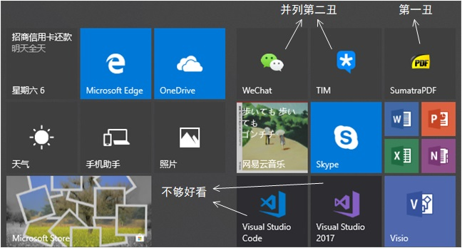
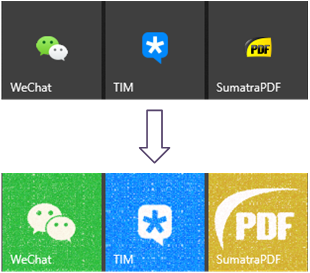
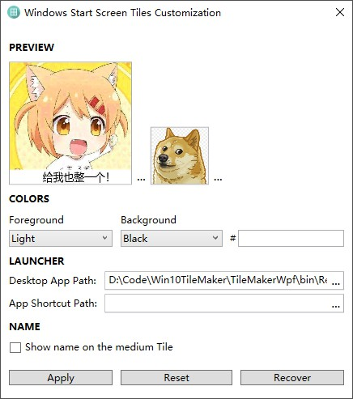
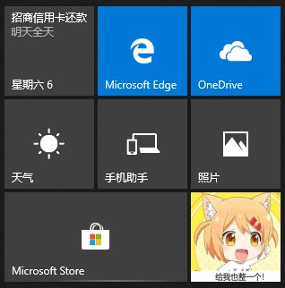

终于迎来清明节小长假, **勤奋好学**的我给自己安排的计划是:

- 先花一天时间看两篇Ⅰ区好文培养一下情操
- 半天复习英语积极备考, 努力提升姿势水平
- 最后一天半online courses给自己充电, 让自己持续保持**优秀**

于是我立马行动, 像往常一样按下win键准备打开看文神器
[SumatraPDF](https://www.sumatrapdfreader.org/free-pdf-reader.html)
, 不料突然被开始菜单的磁贴图标刺痛了双眼：

不瞒你说, 我已经被这个丑陋的磁贴折磨了很久, 而且这一次它让我回想起了曾经疯狂找办法想要替换最终却失败的惨痛经历, 真是

>忍一时越想越气，退一步越想越亏

所以身为**攻城狮**的我当场决定, 今天无论如何也要解决这个问题.

很快找到少数派这篇
[有了它, EXE程序也能用上好看的磁贴](https://sspai.com/post/42486)
, 苦于囊中羞涩, 我没有直接购买文中介绍的工具
[EdgeTile Creators](https://www.microsoft.com/zh-cn/p/edgetile-creators/9n3mgs2xcpr1?activetab=pivot:overviewtab)
, 而是先试用了看起来像是它卵生兄弟的免费版
[egdeTile](https://www.microsoft.com/zh-cn/p/edgetile/9nblggh20dz9?activetab=pivot:overviewtab)
. 果然, 天下并没有免费的午餐, 我忍受了半天它丑陋的UI一通设置之后, 发现每次点击磁贴启动应用竟然都会先加载egdgTile这个程序再通过它来调用目标程序的进程, 所以要么让它一直保持开启, 要么每次都会有个程序窗口一闪而过. 显然, 已经看过
[一击男PV](https://www.bilibili.com/video/av46813514/?p=2)
的我很难继续承担这种闪屏的痛苦, 于是它很快被我卸载. 

功夫不负强迫症, 我总算找到了Windows加载磁贴图标的原理
[How to customize Start screen tiles for desktop apps](https://docs.microsoft.com/en-us/previous-versions/windows/apps/dn393983(v%3dwin.10))
, 原来微软早在Windows8.1就为开始屏幕磁贴的自定义写下了详细的规范, 简单来说系统会加载exe文件所在文件夹中的配置文件, 配置文件命名规范为:

><exe文件名>.VisualElementsManifest.xml

该XML文件中的元素需符合
[微软提供的Schema](https://docs.microsoft.com/en-us/previous-versions/windows/apps/dn393983(v%3dwin.10)#the-desktop-app-tile-customization-xsd)
, 它由XSD(XML Schema Definition)语言形式化地描述, ~~相信大家看过文档之后就能充分理解了~~.

anyway, 看完少数派这篇
[收好这份美化技巧合辑，让你的 Windows 从此与众不同](https://sspai.com/post/41307)
, 就可以上手操作了, 在一顿修改文件后总算达到令我满意的结果:

正当我准备安心继续我的[清明小计划](#jump)时, 我~~灵机一动~~转念一想, 如此繁琐的手动修改配置文件方式, 实在是太不绿色, 太不环保, 太不节能了. 作为一个会写两行Hello word, hello powerpoint的人, 难道就不能自己写个小工具来简化流程? 于是, 在没有进行任何市场调研的情况下, 我身兼产品, 开发, 测试, 运营四职开始了Windows开始屏幕磁贴自定义小工具制作.

耗时一天半, 我完成了程序前后端的开发(总共就没几百行), 它长这样:

按照上面的设置, 它成功地给自己添加了一个磁贴:

它表面上看起来功能十分简陋(不能设置宽图标和大图标), 而实际上比看起来还简陋, 比如设置背景色的功能虽然产品说要加上, 但是开发太懒不想实现就只画了个UI没写底层, ~~毕竟我们是要整个logo换掉嘛要什么背景色~~.

不怕艰险想要试用的朋友可以去
[这里下载](https://github.com/1molPotato/Win10TileMaker/releases)
, 因为要对系统盘开始菜单文件夹进行读写, 所以记得**以管理员身份运行**, 否则会丢出根本没有处理过的异常.

什么, 你说UI不好看, 代码写太乱?

我只能表示

___

然后, 我又花了一晚上写这篇文章, 并且在做文献调研(重新google)的过程中发现别人早就写好了
[比我这个好用一百倍的工具](https://forum.xda-developers.com/windows-10/development/win10tile-native-custom-windows-10-t3248677)
.

